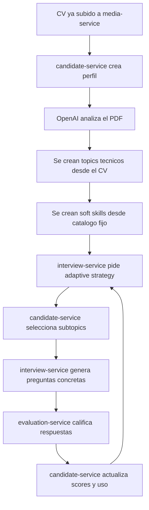
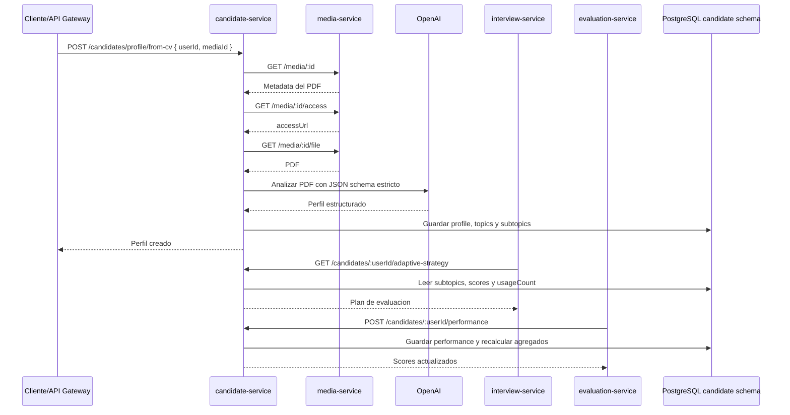
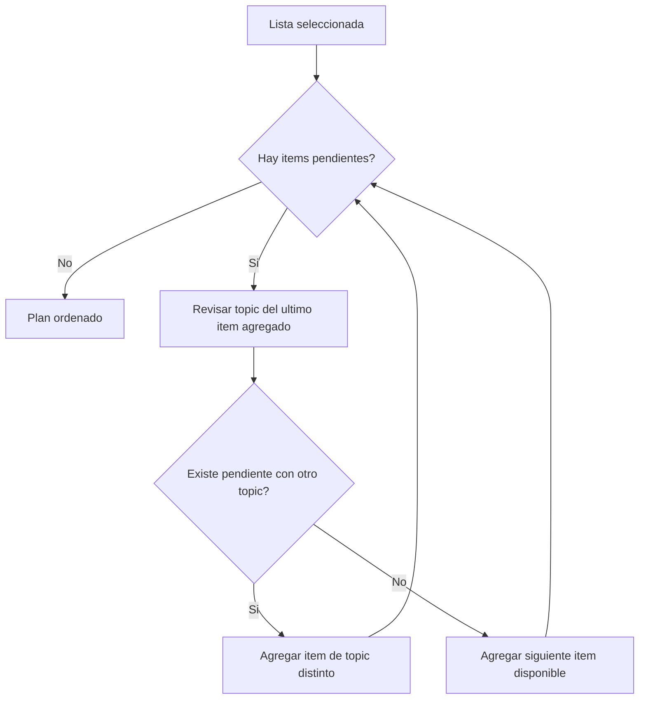
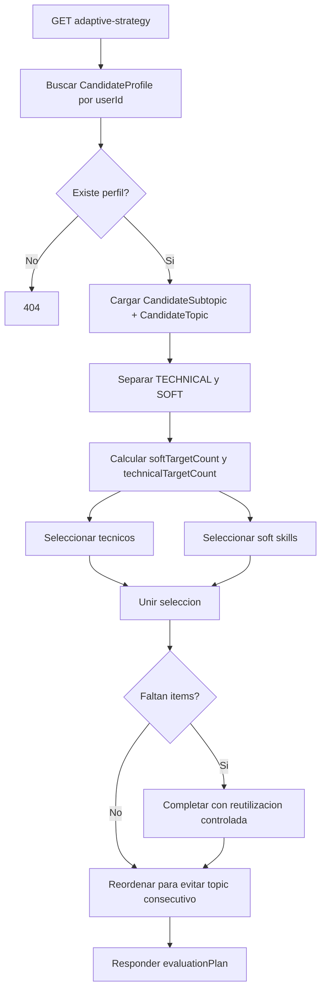
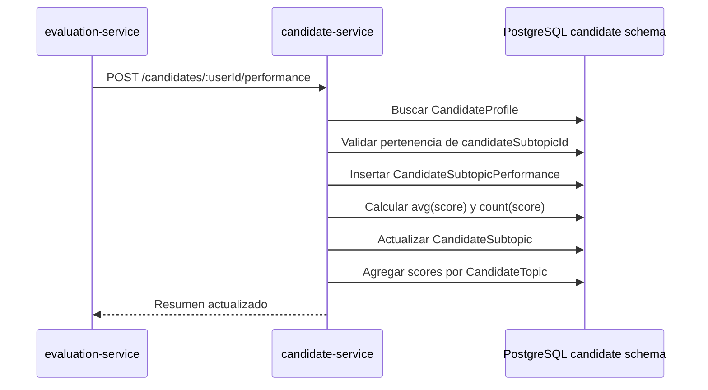

# Candidate Service: adaptabilidad y no estancamiento

Este documento explica como `candidate-service` decide que debe evaluarse en una entrevista adaptativa.

Tiene dos lecturas:

1. Una explicacion natural, orientada a producto o negocio.
2. Una explicacion tecnica, orientada a desarrollo, configuracion y datos usados por el algoritmo.

## Explicacion natural

El servicio no genera preguntas. Lo que genera es un plan de evaluacion.

Ese plan le dice a `interview-service` que areas conviene preguntar, en que orden y por que. Luego `interview-service` se encarga de convertir cada item del plan en preguntas concretas.

En la practica, el algoritmo intenta comportarse como un entrevistador que no se queda atrapado en un solo tema:

- Primero quiere cubrir temas que todavia no se han evaluado.
- Si detecta temas donde el candidato tuvo bajo rendimiento, vuelve a ellos para reforzar.
- Mezcla habilidades tecnicas con habilidades blandas.
- Evita preguntar muchas veces seguidas sobre el mismo topic cuando existen alternativas.
- Si hay pocos temas disponibles, puede reutilizar temas ya evaluados, pero prioriza los de menor uso o bajo score.

Por ejemplo, si una persona tiene en su CV `Node.js`, `PostgreSQL` y `Docker`, y ademas el sistema tiene soft skills como comunicacion y adaptabilidad, el plan puede verse asi:

1. Node.js - Express routing, porque no se ha evaluado.
2. PostgreSQL - consultas SQL, porque no se ha evaluado.
3. Comunicacion - claridad al explicar, para cubrir soft skills.
4. Docker - imagenes y contenedores, porque no se ha evaluado.
5. Node.js - manejo de errores, porque tuvo score bajo antes.

La idea es que la entrevista avance con equilibrio: cubre terreno nuevo, vuelve a puntos debiles y no se queda girando sobre una sola tecnologia.

## Flujo general



## Secuencia entre servicios



## Que devuelve el plan adaptativo

Endpoint:

```http
GET /candidates/:userId/adaptive-strategy?questionCount=8&targetRole=Backend%20Developer&level=JUNIOR
```

Respuesta:

```json
{
  "userId": "user-123",
  "candidateProfileId": "uuid",
  "questionCount": 8,
  "targetRole": "Backend Developer",
  "level": "JUNIOR",
  "evaluationPlan": [
    {
      "candidateTopicId": "uuid",
      "candidateSubtopicId": "uuid",
      "skillType": "TECHNICAL",
      "topic": "Node.js",
      "subtopic": "Express routing",
      "expectedLevel": "BASIC",
      "priority": 1,
      "reason": "Not evaluated yet / coverage"
    }
  ]
}
```

Cada item significa: "para la siguiente pregunta, conviene evaluar este subtopic". No significa que la pregunta ya exista.

## Campos que usa el algoritmo

El algoritmo trabaja principalmente con `CandidateSubtopic` y su `CandidateTopic` padre.

### CandidateSubtopic

| Campo | Uso |
| --- | --- |
| `id` | Se devuelve como `candidateSubtopicId`; `evaluation-service` lo usa para reportar resultados. |
| `candidateTopicId` | Permite agrupar subtopics por topic y evitar repeticion consecutiva del mismo topic. |
| `name` | Nombre legible del subtopic. |
| `skillType` | Divide entre `TECHNICAL` y `SOFT`. |
| `expectedLevel` | Orienta el nivel esperado de evaluacion: `BASIC`, `INTERMEDIATE`, `ADVANCED`. |
| `priority` | Peso de relevancia. Mayor prioridad aparece antes cuando otros criterios empatan. |
| `averageScore` | Promedio historico de scores para ese subtopic. |
| `usageCount` | Cuantas veces se ha evaluado. Sirve para cubrir lo no evaluado y evitar sobreuso. |
| `lastEvaluatedAt` | Fecha de ultima evaluacion. Actualmente se actualiza, pero no decide el orden. |
| `reinforce` | Marca si debe reforzarse porque el score promedio esta bajo el umbral. |

### CandidateTopic

| Campo | Uso |
| --- | --- |
| `id` | Se devuelve como `candidateTopicId`. |
| `name` | Nombre legible del topic. |
| `skillType` | Hereda el tipo general: tecnico o soft. |
| `averageScore` | Promedio agregado desde sus subtopics evaluados. |
| `usageCount` | Suma de usos de sus subtopics. |
| `reinforce` | Indica si el topic completo esta bajo umbral. |

## Parametros configurables

Estos parametros viven en variables de entorno.

| Variable | Default | Uso |
| --- | ---: | --- |
| `SOFT_SKILLS_LIMIT` | `5` | Cuantas soft skills base se crean desde el catalogo fijo al crear el perfil. |
| `ADAPTIVE_WEAK_SCORE_THRESHOLD` | `60` | Score bajo este valor marca subtopics y topics como `reinforce=true`. |
| `ADAPTIVE_COVERAGE_RATIO` | `0.7` | Proporcion objetivo de items dedicados a cubrir subtopics no evaluados. |
| `ADAPTIVE_REINFORCEMENT_RATIO` | `0.3` | Proporcion conceptual para refuerzo. En la implementacion actual se usa de forma complementaria a coverage. |
| `ADAPTIVE_SOFT_SKILLS_RATIO` | `0.3` | Proporcion del plan reservada para soft skills. |
| `ADAPTIVE_MAX_CONSECUTIVE_SAME_TOPIC` | `1` | Configuracion prevista para limitar repeticiones consecutivas. La version actual evita repetir el mismo topic consecutivamente cuando hay otro disponible. |

Nota tecnica: `ADAPTIVE_REINFORCEMENT_RATIO` esta documentada y disponible para evolucion del algoritmo. En el codigo actual, el numero de refuerzos se calcula como el espacio que queda despues de aplicar `ADAPTIVE_COVERAGE_RATIO`.

## Algoritmo paso a paso

### 1. Cargar perfil y subtopics

`candidate-service` busca el perfil por `userId`.

Si no existe perfil, devuelve `404 Candidate profile not found`.

Luego carga todos los subtopics con su topic padre.

### 2. Separar technical y soft

El algoritmo separa:

- `TECHNICAL`: subtopics detectados desde el CV por OpenAI.
- `SOFT`: subtopics creados desde el catalogo fijo del sistema.

### 3. Calcular cupos de soft skills

```text
softTargetCount = min(totalSoftSubtopics, floor(questionCount * ADAPTIVE_SOFT_SKILLS_RATIO))
technicalTargetCount = questionCount - softTargetCount
```

Ejemplo:

- `questionCount = 10`
- `ADAPTIVE_SOFT_SKILLS_RATIO = 0.3`
- cupo soft = `3`
- cupo tecnico = `7`

### 4. Seleccionar cobertura

Para cada grupo, el algoritmo busca subtopics con:

```text
usageCount === 0
```

Esos subtopics nunca han sido evaluados. Se priorizan para ampliar cobertura.

Orden de cobertura:

1. Mayor `priority`.
2. Menor `candidateTopic.usageCount`.
3. Nombre alfabetico como desempate estable.

### 5. Seleccionar refuerzo

Luego busca subtopics debiles:

```text
usageCount > 0
averageScore !== null
averageScore < ADAPTIVE_WEAK_SCORE_THRESHOLD
```

Orden de refuerzo:

1. Menor `averageScore`.
2. Menor `usageCount`.
3. Mayor `priority`.

Esto hace que un subtopic con score muy bajo vuelva antes al plan.

### 6. Completar con balance general

Si todavia faltan items, usa el resto de subtopics.

Orden general:

1. Menor `usageCount`.
2. `reinforce=true` antes que `false`.
3. Mayor `priority`.
4. Nombre alfabetico.

Esto favorece subtopics menos usados y evita estancarse en los que ya aparecieron demasiado.

### 7. Reutilizar si no hay suficientes subtopics

Si el plan no alcanza `questionCount`, puede reutilizar subtopics.

Esto pasa cuando el perfil tiene pocos temas o cuando se pide un numero de preguntas mayor que la cantidad de subtopics disponibles.

La reutilizacion usa el orden general, por lo que tiende a escoger:

- menor `usageCount`
- refuerzos pendientes
- mayor prioridad

### 8. Evitar repeticion consecutiva del mismo topic

Antes de responder, el algoritmo reordena la lista para evitar poner dos items consecutivos del mismo `candidateTopicId` cuando existe otra alternativa.



## Flujo interno de seleccion



## Como se actualizan scores y refuerzos

Endpoint:

```http
POST /candidates/:userId/performance
```

Body:

```json
{
  "interviewId": "interview-123",
  "results": [
    {
      "candidateSubtopicId": "uuid",
      "questionId": "question-1",
      "score": 55,
      "evaluationType": "technical",
      "feedback": "Necesita reforzar manejo de errores."
    }
  ]
}
```

Flujo:

1. Busca el perfil por `userId`.
2. Valida que cada `candidateSubtopicId` pertenezca a ese perfil.
3. Crea registros en `CandidateSubtopicPerformance`.
4. Recalcula el promedio del subtopic.
5. Actualiza `usageCount`.
6. Actualiza `lastEvaluatedAt`.
7. Marca `reinforce=true` si el promedio queda por debajo de `ADAPTIVE_WEAK_SCORE_THRESHOLD`.
8. Recalcula agregados del topic padre.



## Ejemplo practico completo

Supongamos:

- `questionCount=6`
- `ADAPTIVE_SOFT_SKILLS_RATIO=0.3`
- `ADAPTIVE_WEAK_SCORE_THRESHOLD=60`

El algoritmo reserva:

- `floor(6 * 0.3) = 1` item soft.
- `5` items tecnicos.

Si hay estos subtopics:

| Topic | Subtopic | usageCount | averageScore | priority |
| --- | --- | ---: | ---: | ---: |
| Node.js | Express routing | 0 | null | 90 |
| Node.js | Error handling | 1 | 52 | 80 |
| PostgreSQL | Joins | 0 | null | 85 |
| Docker | Images | 0 | null | 70 |
| Comunicacion | Claridad al explicar | 0 | null | 50 |
| Adaptabilidad | Manejo de incertidumbre | 0 | null | 40 |

Puede devolver:

1. Node.js - Express routing: no evaluado.
2. PostgreSQL - Joins: no evaluado y evita repetir Node.js.
3. Docker - Images: no evaluado.
4. Node.js - Error handling: score bajo.
5. Comunicacion - Claridad al explicar: soft skill.
6. Adaptabilidad - Manejo de incertidumbre: completa cobertura si falta material tecnico.

## Que significa no estancamiento

En esta version, no estancamiento significa tres cosas:

1. No sobreusar lo ya evaluado: `usageCount` bajo tiene prioridad.
2. No ignorar debilidades: `averageScore` bajo activa `reinforce`.
3. No repetir topic consecutivo si hay alternativas: el reordenamiento final alterna topics cuando puede.

No significa que un topic nunca pueda repetirse. Si el perfil tiene pocos topics o se pide un plan largo, el sistema puede repetir. Lo importante es que la repeticion sea intencional: por falta de alternativas, por bajo score o por necesidad de completar el plan.

## Limitaciones actuales

- `ADAPTIVE_MAX_CONSECUTIVE_SAME_TOPIC` esta disponible como variable, pero la implementacion actual aplica una regla simple: evita repetir el mismo topic consecutivamente cuando hay otra opcion.
- `lastEvaluatedAt` se persiste, pero todavia no se usa para dar prioridad temporal.
- No se guardan snapshots historicos de planes adaptativos.
- El servicio devuelve plan, no preguntas.
- La diversidad semantica entre preguntas pertenece a `interview-service`, no a `candidate-service`.

## Archivos relevantes

- `src/services/adaptiveStrategyService.js`: seleccion y ordenamiento del plan.
- `src/services/performanceService.js`: entrada de resultados desde `evaluation-service`.
- `src/repositories/candidateRepository.js`: lecturas y escrituras Prisma.
- `prisma/schema.prisma`: modelos `CandidateProfile`, `CandidateTopic`, `CandidateSubtopic` y `CandidateSubtopicPerformance`.
